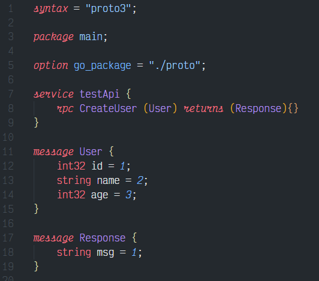
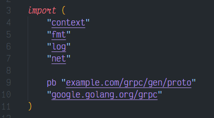
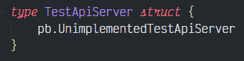
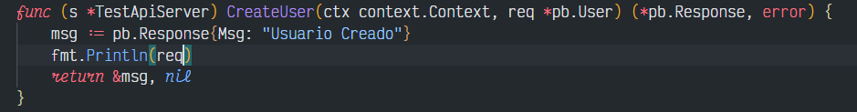
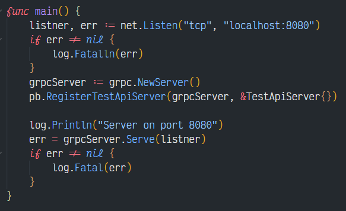
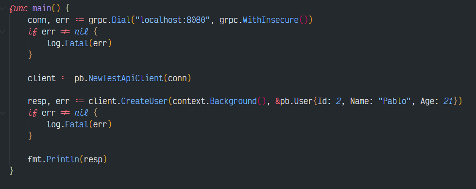

# Ejemplo grpc golang y kafka

### Requisitos

1. Instalar el generador de archivos [proto](https://github.com/protocolbuffers/protobuf/releases).
2. Instalar el lenguaje de [golang](https://golang.org/doc/install).
3. Instalar de la pagina oficial [Kafka](https://kafka.apache.org) o con docker.

## Creacion de proyecto
1. Crear una carpteta para el proyecto
3. Crear archivo de dependencias de go con el siguiente comando:
```
go mod init example.com/grpc
```
4. Descargar dependencias para trabajar con grpc en golang:
```
go install google.golang.org/protobuf/cmd/protoc-gen-go@v1.26
```
```
go install google.golang.org/grpc/cmd/protoc-gen-go-grpc@v1.1
```
5. Crear una carpeta para guardar los archivos genreados:
```
mkdir gen
```
```
mkdir gen/proto
```
6. Crear una carpeta para los arhivos proto:
```
mkdir proto
```
7. Descargar dependencias para kafka en go:
```
go mod download github.com/segmentio/kafka-go
go mod tidy && go mod vendor
```
## Generar archivos golang con proto buffer

1. Crear un archivo proto que contendra la estructura de los mensajes.



2. Ejecutar los siguiente comandos:
```
protoc --proto_path=proto proto/*.proto --go_out=gen/
```
```
protoc --proto_path=proto proto/*.proto --go-grpc_out=gen/
```
3. Para evitar problemas con los paquestes ejecutamos el siguiente comando:
```
go mod tidy
```
## Implementacion de grpc del lado del servidor
1. Importar el paquete generado por proto colocandole un alias cualquiera, para este ejemplo se uso pb:



2. Generar struct para la utilizacion de la interfza generada por proto:



3. Implementar la interfaz que genero proto de los servicios:



4. Levantar servidor de grpc:



## Implementacion de grpc del lado del cliente

1. Importar el paquete generado por proto colocandole un alias cualquiera, para este ejemplo se uso pb:


2. Hacer la conexion del cliente al servidor:


