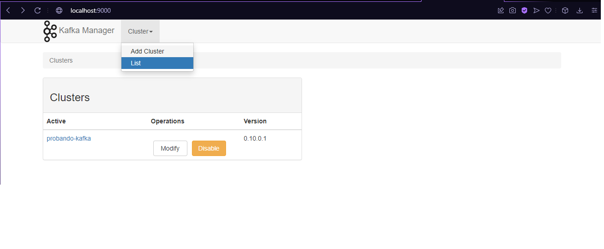
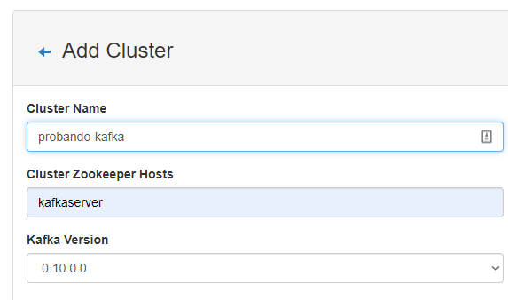
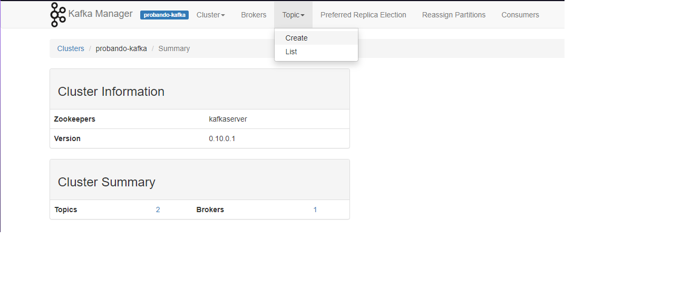
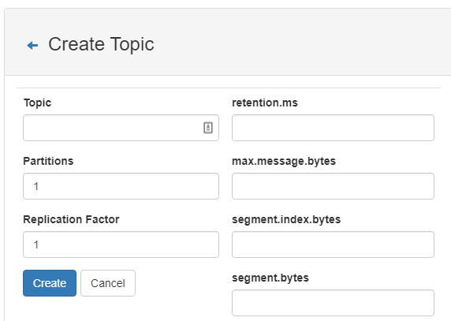
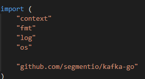
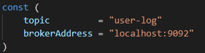
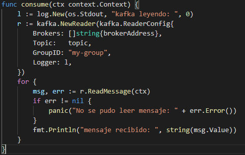
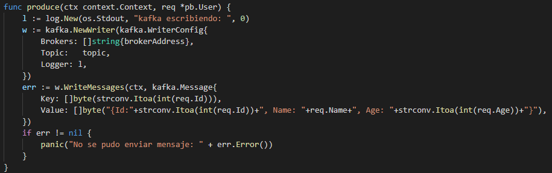
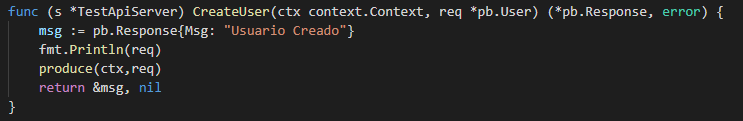

# Ejemplo grpc golang y kafka

### Requisitos

1. Instalar el generador de archivos [proto](https://github.com/protocolbuffers/protobuf/releases).
2. Instalar el lenguaje de [golang](https://golang.org/doc/install).
3. Instalar de la pagina oficial [Kafka](https://kafka.apache.org) o con docker.

## Creacion de proyecto
1. Crear una carpteta para el proyecto
3. Crear archivo de dependencias de go con el siguiente comando:
```
go mod init example.com/grpc
```
4. Descargar dependencias para trabajar con grpc en golang:
```
go install google.golang.org/protobuf/cmd/protoc-gen-go@v1.26
```
```
go install google.golang.org/grpc/cmd/protoc-gen-go-grpc@v1.1
```
5. Crear una carpeta para guardar los archivos genreados:
```
mkdir gen
```
```
mkdir gen/proto
```
6. Crear una carpeta para los arhivos proto:
```
mkdir proto
```
7. Descargar dependencias para kafka en go:
```
go mod download github.com/segmentio/kafka-go
go mod tidy && go mod vendor
```
## Generar archivos golang con proto buffer

1. Crear un archivo proto que contendra la estructura de los mensajes.


2. Ejecutar los siguiente comandos:
```
protoc --proto_path=proto proto/*.proto --go_out=gen/
```
```
protoc --proto_path=proto proto/*.proto --go-grpc_out=gen/
```
3. Para evitar problemas con los paquestes ejecutamos el siguiente comando:
```
go mod tidy
```
## Implementacion de grpc del lado del servidor
1. Importar el paquete generado por proto colocandole un alias cualquiera, para este ejemplo se uso pb:


2. Generar struct para la utilizacion de la interfza generada por proto:


3. Implementar la interfaz que genero proto de los servicios:


4. Levantar servidor de grpc:


## Implementacion de grpc del lado del cliente

1. Importar el paquete generado por proto colocandole un alias cualquiera, para este ejemplo se uso pb:


2. Hacer la conexion del cliente al servidor:


## Apache Kafka

1. Creación de Cluster de Kafka
   
   Primero debemos entrar al http://localhost:9000 que es donde esta el servicio de kafka, y dar en Add Cluster.
   
   Luego, creaemos el cluster donde se conectara nuestra API producer y nuestro API worker.
   
   Solo debemos poner un nombre al cluster el que quieran, poner el host del zookeeper y la version de kafka que queremos utilizar.

2. Creación del Topic
   Ya dentro de nuestro cluster de kafka, crearemos nuestro topic, simplemente debemos irnos a la pestaña topic y dar click en Create.
   
   Luego simplemente debemos darle un nombre a nuestro topic, poner cuantas particiones utilizara y tambien el factor de replica.
   
   Nota: El factor de replica no puede ser mayor a la cantidad de brokers que se tienen en nuestro caso solo es un broker.

## Creacion de Worker o Consumer de Kafka

1. Importar paquetes a utilizar



2. Crear las contantes para el topic, y broker de kafka



3. Crear la función consume que es el que consumira los mensajes enviados por el producer de kafka



## Modificar el server de grpc para que funcione tambien como producer de kafka

1. Crear la función produce dentro del server.go
   


2. En la función CreateUser enviar el user a la función produce

